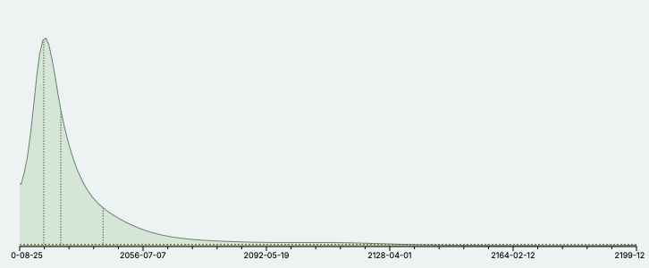

# The Problem with AI Safety
Killian Steunou

## Table of Contents

- [1. Introduction](#1-introduction)
	- [1.1 The promise and peril of AI](#11-the-promise-and-peril-of-ai)
	- [1.2 The current state of the debate](#12-the-current-state-of-the-debate)
- [2. Can superintelligence even exist?](#2-can-superintelligence-even-exist)
	- [2.1 Skepticism About AI Superintelligence](#21-skepticism-about-ai-superintelligence)
	- [2.2 Why superintelligence remains elusive](#22-why-superintelligence-remains-elusive)
- [3. How Imminent Is the Risk?](#3-how-imminent-is-the-risk)
	- [3.1 Why predictions of AGI are premature](#31-why-predictions-of-agi-are-premature)
	- [3.2 The problem with predictive timelines](#32-the-problem-with-predictive-timelines)
- [4. How dangerous is AI, really?](#4-how-dangerous-is-ai-really)
	- [4.1 Misuse risks](#41-misuse-risks)
		- [4.1.1 Examples of misuse](#411-examples-of-misuse)
		- [4.1.2 Are some risks exaggerated?](#412-are-some-risks-exaggerated)
	- [4.2 Conceptual issues: defining safety and alignment](#42-conceptual-issues-defining-safety-and-alignment)
	- [4.3 Why intelligence alone may not be that dangerous](#43-why-intelligence-alone-may-not-be-that-dangerous)
- [5. Neglected dimensions of AI safety](#5-neglected-dimensions-of-ai-safety)
	- [5.1 Societal and regulatory oversights](#51-societal-and-regulatory-oversights)
	- [5.2 Environmental costs](#52-environmental-costs)
- [6. AI coordination: a game-changer or a risk multiplier?](#6-ai-coordination-a-game-changer-or-a-risk-multiplier)
	- [6.1 Potential for AI coordination](#61-potential-for-ai-coordination)
	- [6.2 Challenges to develop coordination](#62-challenges-to-develop-coordination)
- [7. Rethinking AI safety](#7-rethinking-ai-safety)
	- [7.1 Balancing Speculative and Immediate Risks](#71-balancing-speculative-and-immediate-risks)
	- [7.2 Developing clearer definitions and frameworks](#72-developing-clearer-definitions-and-frameworks)
	- [7.3 Multidisciplinary approaches for AI safety](#73-multidisciplinary-approaches-for-ai-safety)
## 1. Introduction 
Artificial intelligence has rapidly evolved from a fascinating concept to a transformative force reshaping industries and daily life. From language models that generate human-like text to systems capable of artistic creativity or solving complex problems, the potential of AI seems infinite. Yet, alongside this excitement, a growing sentiment of fear has emerged, warnings about uncontrolled AI systems, existential risks, and the need for strict regulations. While these concerns deserve thoughtful attention, they often risk overshadowing the incredible progress and possibilities AI offers. This article explores the challenges in the current AI safety discourse and argues for a balanced perspective that avoids slowing down innovation while addressing genuine risks.

### 1.1 The promise and peril of AI
Artificial intelligence stands at the forefront of technological progress, promising a lot of benefits in almost every domains. Its applications are already visible: automating routine tasks, optimizing complex systems, and even unlocking new frontiers in areas like [healthcare](https://deepmind.google/discover/blog/codoc-developing-reliable-ai-tools-for-healthcare/), [education](https://blog.duolingo.com/large-language-model-duolingo-lessons/), and [climate modeling](https://deepmind.google/discover/blog/graphcast-ai-model-for-faster-and-more-accurate-global-weather-forecasting/). These advancements could lead to unprecedented efficiency, enhanced creativity, and solutions to problems previously thought impossible to solve.

At the same time, the rapid pace of AI development raises legitimate concerns. Critics highlight potential dangers such as biased decision-making, misuse by malicious actors, and the disruption of labor markets. Some even foresee scenarios where AI surpasses human intelligence, leading to a loss of control. These fears, while important to consider, must not overshadow the tangible progress being made today. Instead of focusing on hypothetical existential risks, we should ensure that innovation thrives while addressing real and present challenges responsibly.

### 1.2 The current state of the debate
The conversation around AI safety has become increasingly polarized. On one side, some argue that AI could soon spiral out of human control, necessitating immediate and strict regulation to mitigate existential risks. This perspective often highlights scenarios involving "superintelligence" or autonomous systems acting against human interests. On the other side, there are those who view these fears as speculative, warning that premature regulation might reduce innovation and slow down progress in a field that could bring immense benefits to humanity.

This division is reflected even among the pioneers of deep learning. Geoffrey Hinton, often referred to as one of the "godfathers of deep learning," has publicly expressed concerns about AI's potential dangers, aligning himself with the so-called "AI doomers." In contrast, Yann LeCun, another foundational figure in the development of deep learning, strongly criticizes these alarmist views. LeCun argues that the risks are overstated and that such narratives could unnecessarily hinder the progress of AI research.

What complicates the debate further is the lack of consensus on the nature of the risks. Are we worried about near-term issues like biased algorithms, economic disruption, and cybersecurity vulnerabilities? Or are we prioritizing hypothetical, long-term scenarios where artificial intelligence could become more powerful than humanity itself? This divergence of focus has made it difficult to strike a balance between preparing for future challenges and addressing present-day problems.

This article argues that current AI safety efforts often misdirect attention toward speculative risks, diverting resources and energy from tackling practical challenges. By doing so, we risk hampering progress in a field that has the potential to transform our world for the better. It is crucial to examine these debates critically and advocate for an approach that fosters both innovation and responsibility.
In the following, we will delve into this question in detail, starting with the question of whether superintelligence is even possible, followed by an exploration of its timelines, potential dangers, and overlooked dimensions of AI safety. Finally, we will propose a balanced path forward that ensures progress while addressing legitimate concerns.

## 2. Can superintelligence even exist?
The possibility of machines surpassing human intelligence has long captured the imagination of researchers, policymakers, and the public. This idea, dramatized in movies like _The Terminator_ or inspired by Isaac Asimov's _Robot series_, conjures both amazement and fear, depicting a future where artificial entities far exceed human capabilities in every domain. For some, this vision represents boundless potential for innovation; for others, it raises deep concerns about the loss of control over such powerful systems. These cultural narratives have shaped public perception, amplifying fears of runaway intelligence and dystopian outcomes. Yet, before debating how to regulate or manage such systems, we must address a fundamental question: is this vision even realistic? Skeptics argue that superintelligence may be inherently unattainable or that its emergence is far more complex and uncertain than these dramatic works suggest. In the following, we will explore their arguments and what they mean for the broader debate on AI safety.

### 2.1 Skepticism About AI Superintelligence
The idea that machines could achieve superintelligence has its skeptics. Some argue that true intelligence is inherently tied to biological processes, making replication by artificial systems impossible. They suggest that the human brain relies on unique mechanisms, beyond the reach of digital computation. Additionally, qualities like creativity and common sense, deeply embedded in human cognition, are seen as too complex to model within machines.

Furthermore, skepticism exists around whether intelligence can generalize across diverse domains. Current AI excels in specific tasks but lacks the broad adaptability of human intelligence. This raises doubts about AI matching or surpassing human flexibility. Consequently, fears of uncontrollable, hyperintelligent AI may stem from a misunderstanding of current technological capabilities.

Critics often view predictions of machine superintelligence as speculative and disconnected from AI's actual trajectory and limitations. While these concerns warrant consideration, they might underestimate technology's potential to evolve beyond historical constraints.

### 2.2 Why superintelligence remains elusive
While skeptics highlight significant challenges in achieving machine intelligence, dismissing its potential overlooks the unpredictable nature of technological progress. History is full of breakthroughs that once seemed unattainable. For example, neural networks have demonstrated [emergent capabilities](https://www.quantamagazine.org/the-unpredictable-abilities-emerging-from-large-ai-models-20230316/) beyond initial expectations, suggesting AI can evolve in surprising ways. However, this optimism must be balanced with recognition of current fundamental limitations.

A critical limitation is our incomplete understanding of the human brain. Human intelligence arises from complex, continuous biological processes that current AI architectures, based on discrete parameters and methods like backpropagation, cannot replicate. Without a paradigm shift—such as exploring organic or hybrid computing platforms—achieving true machine intelligence remains distant.

Additionally, the physical limitations of computing power pose a significant barrier. Scaling up models through larger datasets and more parameters is unsustainable and doesn't address the qualitative leap needed to mimic human cognition's adaptability and efficiency. Progress may require breakthroughs in hardware, possibly through new computational forms that better emulate biological systems.

Thus, the path to superintelligence hinges not on incremental improvements but on bold innovations that transcend traditional AI paradigms.

The challenges in achieving true intelligence in machines, from biological complexity to computational constraints, suggest that we are still far from realizing the kind of superintelligence often depicted in science fiction. However, even if we accept the possibility of achieving such breakthroughs in the future, a pressing question remains: how soon could this happen? Understanding the timelines for advanced AI development is crucial for framing the risks and opportunities ahead.

## 3. How Imminent Is the Risk?
Predicting the arrival of artificial general intelligence (AGI) has sparked interest, with researchers and enthusiasts offering forecasts based on current trends in AI development. On the platform Metaculus, over 1,400 forecasters have contributed to a detailed poll on [this question](https://www.metaculus.com/questions/5121/date-of-artificial-general-intelligence/). The probability density graph reveals a notable peak around 2028, with the mean and median predictions centering on 2032, just a few years from today. 

Such forecasts reflect growing confidence in the rapid pace of AI progress, but they also raise critical questions: are these timelines realistic, or do they overlook the significant obstacles that remain? To address this, we will explore the arguments for and against these near-term predictions and assess the factors influencing the timeline for AGI.

### 3.1 Why predictions of AGI are premature
The confidence in near-term predictions of AGI, as seen in platforms like [Metaculus](https://www.metaculus.com), often relies on the current trajectory of AI advancements. Proponents point to rapid improvements in large language models, multimodal systems, and the exponential growth of computational resources as indicators that AGI could emerge within the next decade. However, this optimism frequently underestimates the fundamental challenges that still stand in the way.

One key issue is the physical limitation of scaling. Progress in AI has largely been driven by increasing computational power and model sizes, but this approach faces diminishing returns. Training larger models requires exponentially more resources, and there are finite limits to hardware capabilities and energy availability. Without breakthroughs in how we design and optimize AI systems, scaling alone will likely plateau before achieving general intelligence, if not [already](https://www.reuters.com/technology/artificial-intelligence/openai-rivals-seek-new-path-smarter-ai-current-methods-hit-limitations-2024-11-11/).

Another overlooked factor is the role of data. Current AI systems rely heavily on vast datasets curated from human-generated content, much of which has already been utilized. As we approach the limits of available high-quality data, creating systems capable of general reasoning will require new approaches, such as generating synthetic data or fundamentally rethinking how models learn.

Additionally, the timeline predictions often assume a linear progression of breakthroughs. In reality, progress in AI has been marked by periods of rapid development followed by plateaus. For instance, after the initial success of neural networks in the 1980s, the field experienced a "winter" of slowed progress before the resurgence of deep learning in the 2010s. Predicting a smooth path to AGI ignores the possibility of similar disruptions.

Finally, achieving general intelligence is not simply a matter of more powerful systems. It requires understanding and replicating the flexibility, creativity, and adaptability of human cognition, qualities that current AI lacks and that may demand a paradigm shift in how we build these systems.
While the forecasts on Metaculus are intriguing and reflect genuine excitement about the field, they may also reflect an overestimation of how close we are to solving these foundational challenges. In the context of these limitations, the confidence in AGI arriving by 2032 might be premature.

### 3.2 The problem with predictive timelines
Technological predictions have historically been overly optimistic, and AGI timeline forecasts are no exception. Predictions for milestones like flying cars or nuclear fusion often underestimated their complexity. Robin Hanson, in ["AI Risk, Again"](https://www.overcomingbias.com/p/ai-risk-again), argues that technological revolutions typically unfold gradually rather than through sudden, uncontrollable leaps. He notes that transformations like the Industrial Revolution occurred over decades through incremental adoption and refinement, not abrupt use. Similarly, AGI is likely to emerge through steady progress rather than a rapid "foom" scenario where one AI system instantly surpasses all others.

In my opinion, AI progress has already begun to slow, though this may be obscured by the current hype around transformers and large language models. While transformers excel in tasks like language, image, and video processing, I believe **transformers are not all we need.** Their dominance has narrowed the research focus, leading to an overreliance on scaling existing architectures instead of exploring fundamentally new ideas. This obsession with transformers may delay the next significant AI breakthroughs. Achieving AGI will require moving beyond transformers and attention-based mechanisms, a shift unlikely to occur until transformer hype subsides, possibly taking at least 15 years.

Hanson’s argument supports this view: transformative breakthroughs rarely result from refining existing methods alone. They require time, exploration, and the willingness to abandon popular approaches when they reach their limits. Until the research community moves past the transformer era, AI progress will likely remain incremental, making near-term AGI predictions overly optimistic.

While AGI timelines remain uncertain, the debate extends beyond when it might emerge to how dangerous it could be. Even if AGI is distant or unlikely, discussions about AI risks are already underway. Assessing whether these risks are exaggerated or genuine is crucial for guiding AI safety and development strategies.
## 4. How dangerous is AI, really?
Discussions about AI risks often focus on worst-case scenarios, but how real are these dangers, and how should we address them?
### 4.1 Misuse risks
#### 4.1.1 Examples of misuse
While much of the AI safety debate centers on speculative risks, there are immediate ways AI systems could be misused. For example, AI tools can enhance cyberattacks by generating realistic phishing emails, cracking passwords, or automating network infiltration, significantly increasing cybercrime's scale and sophistication.

Another concern is the spread of misinformation. AI-generated content, such as deepfakes or made up text, can manipulate political campaigns, social movements, or individual reputations, decreasing public trust in information sources and institutions.

The use of autonomous weapons is another alarming possibility. AI-controlled drones or military systems could lower the barrier to initiating conflicts by reducing the need for human involvement, potentially destabilizing global security.

While bioterrorism risks involving AI tools in genetics or biology remain speculative, the dual-use nature of many AI applications warrants careful monitoring and regulation.

These examples demonstrate that AI’s misuse potential affects the present, necessitating vigilance, transparency, and well-crafted policies to mitigate harm without preventing progress.

#### 4.1.2 Are some risks exaggerated?
While the misuse of AI poses real and immediate dangers, some scenarios appear significantly unlikely. A good example is the fear that AI systems could design and deploy bioweapons on its own, with minimal human intervention. These concerns, while worth considering, frequently lack practical evidence to support their feasibility.

For instance, the idea that AI could autonomously create bioweapons assumes a level of understanding and intent that current systems simply do not possess. AI tools used in biology or chemistry are highly task-specific and require human supervision for most processes. Even with access to vast datasets, the complexity of designing and testing harmful pathogens involves steps that go far beyond the capabilities of existing AI systems.

Similarly, large-scale manipulation through AI-generated misinformation often assumes an audience that is unable to critically evaluate content. While deepfakes and fabricated text can are indeed a danger, their effectiveness tends to decrease with increased public awareness and the development of detection tools.

These exaggerated fears might drive attention and resources away from addressing the more immediate and tangible risks discussed earlier. By focusing too heavily on worst-case scenarios, we may overlook practical solutions to current challenges that are already affecting societies and industries.

### 4.2 Conceptual issues: defining safety and alignment
A major obstacle in AI safety discussions is the lack of precise, universally accepted definitions for concepts like "human-level AI," "superintelligence," and "alignment." These terms carry varying interpretations, leading to confusion and misaligned goals among researchers, policymakers, and industry leaders.

For instance, "human-level AI" often refers to systems that match human capabilities across all domains. However, this raises questions: Does it mean replicating human cognitive processes or just achieving equivalent outcomes? Should it include emotional intelligence, creativity, and ethical reasoning, or only technical proficiency? Without clarity, efforts to prepare for or regulate such systems risk inconsistency.

Similarly, "alignment" broadly refers to ensuring AI systems act in ways consistent with human values and goals. Yet, human values are diverse and context-dependent, making it challenging to align AI with a single set of values without oversimplification. Additionally, maintaining alignment as systems evolve and interact with the world presents challenges.

The ambiguity surrounding "safety" compounds these issues. Some define safety as preventing harm to humans or the environment, while others emphasize maintaining control over AI behavior. This lack of consensus leads to fragmented research efforts, with different teams addressing different interpretations of safety.

In my view, this vagueness is one of the most problematic aspects of the AI safety discourse. Clear definitions are essential for designing robust risk mitigation frameworks and facilitating effective communication between technical researchers and policymakers. Creating global definitions for these key terms, through interdisciplinary collaboration among technical experts, ethicists, and social scientists, is a crucial first step. This shared understanding is necessary for advancing AI safety effectively.

AI risks span immediate misuse and long-term concerns, but both are clouded by unclear definitions of key concepts like safety and alignment. Bridging these gaps is essential for moving beyond speculative fears and addressing real challenges effectively, paving the way for a clearer and more practical AI safety discourse.

### 4.3 Why intelligence alone may not be that dangerous
While the AI safety debate often centers on the dangers of intelligent systems, it's crucial to recognize that intelligence alone doesn't equate to power or threat. The most intelligent humans aren't necessarily the most influential or dangerous. Similarly, AI systems, regardless of their advancement, require access to physical systems or resources to make changes in the world.

Current AI lacks autonomy and depends on human inputs for deployment and action. Even highly capable models operate within predefined constraints, limiting their outputs based on their environments. This dependence challenges the assumption that intelligence alone could lead to catastrophic scenarios without human oversight.

Moreover, AI safety discourse frequently overlooks broader societal and environmental dimensions. A truly comprehensive approach to AI safety must address these neglected areas to ensure that AI development aligns with broader human and planetary well-being.

## 5. Neglected dimensions of AI safety
AI’s influence extends far beyond technical capabilities, shaping economies, societies, and even the environment. These dimensions of AI impact are often overshadowed by debates about existential risks, but they are no less important. Addressing these neglected areas is critical to ensuring that AI development aligns with larger human and planetary well-being, encouraging progress that benefits everyone sustainably.
### 5.1 Societal and regulatory oversights
Rapid AI advancement has introduced significant societal challenges. One immediate concern is AI's economic impact on labor markets. As automation replaces jobs across sectors, issues of job displacement and economic inequality become increasingly critical. Without proactive measures, AI's benefits may concentrate among a select few, exacerbating existing disparities.

Regulatory challenges further complicate the landscape. Policies driven by fears of speculative AI risks can accidentally slow down innovation. Too restrictive regulations may deter smaller organizations or researchers from pursuing AI projects, leading to power concentration within a few large tech companies. This centralization hampers progress and raises ethical concerns about AI control and deployment.

Additionally, the global race for AI dominance is reshaping international power dynamics. Nations striving to lead in AI development may create geopolitical tensions and create disparities in access to AI's benefits. Countries lagging in AI capabilities could face growing economic and political disadvantages, enlarging global inequality.

Addressing these societal and regulatory challenges requires a balanced approach that mitigates real risks without reducing innovation. Forward-thinking policies should promote equitable AI development and encourage global cooperation, ensuring AI's transformative potential benefits all of humanity. As highlighted by [Rohit Kundu](https://www.lakera.ai/blog/risks-of-ai), understanding and mitigating AI's multifaceted risks is crucial in our increasingly AI-driven world.

### 5.2 Environmental costs
The [environmental costs of AI development](https://oecd.ai/en/wonk/understand-environmental-costs) represent another critical dimension of safety, one that impacts the long-term sustainability of the planet. The rapid scaling of AI, particularly through large-scale models, requires immense data storage and processing power, leading to significant energy consumption and carbon emissions. For example, "training a general-purpose AI model now requires about 10 billion times more computational power than state-of-the-art models in 2010", with the energy demands projected to rival the annual electricity consumption of countries like Austria or Finland by 2026.

AI’s environmental costs are both direct and indirect. Direct impacts include the lifecycle emissions of AI compute resources (production, operation, and disposal stages) which heavily affect energy consumption and water resources. Indirect impacts, such as those resulting from AI applications in smart grids or precision agriculture, can be positive but also introduce risks like unsustainable consumption patterns. Quantifying these effects remains a challenge, partly due to the lack of standardized methods for measuring AI-specific energy use.

Data management is another critical factor. Training AI systems relies on vast datasets, yet inefficient storage practices and the proliferation of synthetic data contribute to unnecessary energy use and emissions. Studies indicate that up to 80% of business data stored on-premise is redundant or obsolete. Adopting data minimization practices, prioritizing efficient storage, and responsibly disposing of unused data could significantly reduce AI’s environmental footprint.

To mitigate these issues, the AI community must embrace environmentally responsible design choices. This includes evaluating the necessity of large general-purpose models for specific tasks in favor of simpler, less resource-intensive alternatives where feasible. Open-source datasets, decentralized training methods, and reducing reliance on new data creation also present opportunities for improving sustainability. Policymakers, researchers, and industry leaders must collaborate to embed these principles into AI lifecycle management, aligning the technology’s growth with broader goals of digital decarbonization.

By recognizing and addressing its environmental costs, AI can progress responsibly, ensuring that its benefits do not come at the expense of the planet’s future. This expanded view of AI safety incorporates not only societal and technical considerations but also the sustainability of the ecosystems upon which humanity depends.

## 6. AI coordination: a game-changer or a risk multiplier?
### 6.1 Potential for AI coordination
A central debate in AI safety is whether AI systems can [coordinate](https://www.lesswrong.com/posts/gYaKZeBbSL4y2RLP3/strategic-implications-of-ais-ability-to-coordinate-at-low) at low cost and large scale or remain fundamentally uncoordinated. If AIs lack this "special ability," the development of many independent systems could lead to a **multipolar scenario** where no single AI dominates and power is distributed among multiple agents.

In a multipolar scenario, risks from unaligned or competing systems may be mitigated. Without the ability to merge utility functions or form centralized networks, AIs would operate within distinct parameters, relying on external mechanisms like laws and governance systems to maintain order. This reduces fears of a "singleton" AI or single superintelligence consolidating power and bypassing human oversight.

Supporters of AI coordination argue that systems capable of merging utility functions could form efficient, self-regulating networks, reducing conflict and redundancy. However, this assumes breakthroughs in coordination technologies that may not materialize. As Wei Dai highlights, aligning goals across independent systems poses significant technical challenges, making seamless AI coordination unlikely. This suggests that AIs, like human entities, will more likely compete than cooperate, maintaining a distributed power balance.

From a governance perspective, the lack of unique AI coordination capabilities has important implications. If AIs remain decentralized and competitive, existing regulatory frameworks focused on transparency, interoperability, and competition may suffice to manage risks. Heavy-handed regulation aimed at preventing unified AI coordination could stifle innovation without addressing actual threats. Instead, policies should promote the development of robust, diverse systems compatible with human oversight.

The multipolar scenario provides a pragmatic view of AI's future, challenging the assumption that AIs will inherently consolidate power. It emphasizes fostering a competitive yet cooperative environment where innovation thrives without jeopardizing societal stability.

### 6.2 Challenges to develop coordination
While AI coordination is theoretically plausible, it faces significant practical and technical obstacles, making a multipolar scenario more likely than unified, cooperative AI networks.

A major technical barrier is aligning goals across systems. Different AIs are designed with distinct architectures, purposes, and constraints, making merging utility functions or objectives inherently complex. Additionally, emergent behaviors in AI systems can lead to conflicts rather than alignment.

[Corrigibility](https://www.alignmentforum.org/tag/corrigibility) adds another layer of complexity. Ensuring AIs remain corrigible (allowing human oversight or modification) can limit their ability to form cooperative networks. A non-corrigible AI might refuse to integrate with other systems, creating a competitive dynamic that undermines large-scale coordination efforts. This tension between safety and competitiveness reduces the feasibility of unified AI coordination.

Moreover, the competitive landscape of AI development complicates coordination. Companies and nations racing for AI dominance are driven by economic and strategic incentives, fostering fragmentation rather than collaboration. Independent AIs optimized for individual goals are less likely to align for collective outcomes.

Given these challenges, assuming that AIs will naturally coordinate is unrealistic. Governance strategies should reflect a multipolar AI ecosystem, emphasizing transparency and interoperability instead of enforcing centralized cooperation. Recognizing these limitations helps refocus AI safety efforts on practical and achievable objectives.

## 7. Rethinking AI safety
Rethinking AI safety requires moving beyond polarized debates and speculative fears to embrace a balanced, practical, and forward-thinking approach that addresses current challenges while preparing for future possibilities.
### 7.1 Balancing Speculative and Immediate Risks
AI safety discussions often rely heavily toward speculative scenarios involving superintelligence or catastrophic takeovers. While these concerns are intellectually stimulating, they risk diverting attention and resources from immediate, observable challenges. Issues like algorithmic bias, cybersecurity vulnerabilities, and systemic impacts on labor markets are not hypothetical: they are already affecting society.

Focusing on these tangible risks offers two key benefits. First, addressing practical issues builds trust in AI technologies, paving the way for responsible deployment and innovation. Second, solving immediate challenges can indirectly mitigate long-term risks. For example, improving robustness and transparency in AI systems today reduces the likelihood of unpredictable behaviors in more advanced systems.

Balancing speculative fears with practical concerns does not mean ignoring the future. Instead, it ensures that efforts to manage risks are grounded in reality and provide value now. By prioritizing actionable solutions, we can create a safer and more sustainable foundation for AI’s continued growth.

### 7.2 Developing clearer definitions and frameworks
A key obstacle in AI safety is the lack of precise definitions for critical concepts like "alignment," "safety," and "intelligence." These terms often carry ambiguous or conflicting meanings across different fields, hampering risk mitigation efforts and leading to fragmented priorities.

Does "alignment" mean strict adherence to universal human values, and if so, whose values? Can we achieve a shared understanding of "safety" when interpretations range from technical robustness to ethical considerations? What truly defines "intelligence" in the context of AI?

Without clear definitions, designing effective frameworks to address risks and guide development is challenging. To overcome these issues, robust frameworks that establish shared meanings and evaluation criteria are necessary. These frameworks should define key terms and offer standardized methods to test and measure AI safety and alignment. Interdisciplinary collaboration among technical researchers, ethicists, and policymakers is essential to ensure these definitions are comprehensive and actionable.

### 7.3 Multidisciplinary approaches for AI safety
AI safety requires more than technical solutions, it demands collaboration across disciplines. Researchers, policymakers, and industry leaders must work together to address risks while promoting innovation. Societal perspectives, such as the impact on labor markets and global inequalities, should also inform these efforts to ensure AI aligns with humanity’s broader goals.

Sustainability is another critical dimension. The environmental costs of AI, from energy usage to resource consumption, must be minimized through efficient algorithms and responsible deployment. By integrating diverse perspectives and prioritizing sustainability, we can create a balanced and comprehensive approach to AI safety.

---

To summarize and conclude, in my point of view, the discourse on AI safety must move beyond fear and speculation, focusing instead on practical solutions, clearer frameworks, and collaboration across disciplines. I believe that by addressing today’s challenges while preparing for tomorrow’s opportunities we can ensure that AI continues to serve humanity’s best interests.
